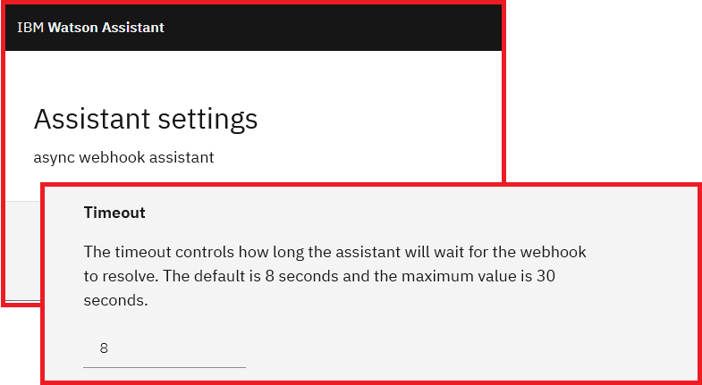
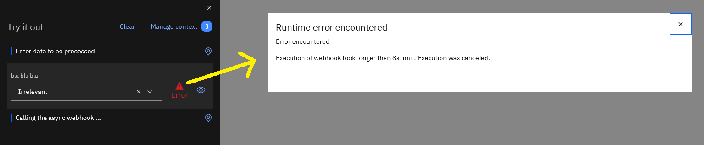

# Asynchronous webhooks with IBM Watson Assistant

Webhooks must return before a configured timeout or else they fail. This sample demonstrates how your chatbot can use web services that require asynchronous handling.

See: [Blog post](https://sarah-packowski.medium.com/asynchronous-webhooks-with-ibm-watson-assistant-4d2844148aa8)

&nbsp;

&nbsp;

&nbsp;

